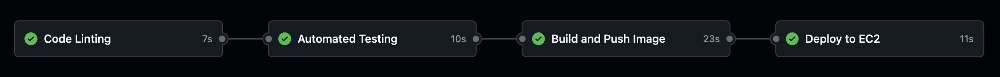
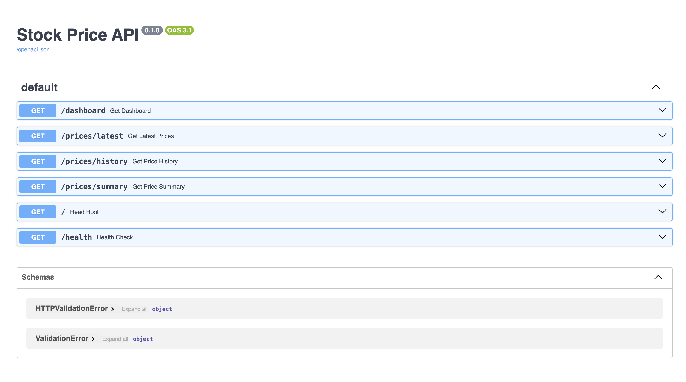

# CI/CD Deployment Pipeline

A production-style DevOps project demonstrating automated build, test, and deployment of a containerized Python API to AWS cloud infrastructure.

## Architecture

````
Push to main
     │
     ▼
GitHub Actions
     │
     ├── Stage 1: Lint (flake8)
     │
     ├── Stage 2: Test (pytest)
     │
     ├── Stage 3: Build & Push Docker Image → Docker Hub
     │
     └── Stage 4: SSH Deploy to AWS EC2
````

## Tech Stack

- **App:** Python, FastAPI
- **Containerization:** Docker
- **CI/CD:** GitHub Actions
- **Infrastructure:** Terraform, AWS EC2
- **Scripting:** Bash

## Screenshots

### Pipeline in GitHub Actions


### Live API on EC2


## How It Works

**CI (Continuous Integration):** Every push to `main` triggers the GitHub Actions pipeline. It first runs `flake8` to lint the code, then `pytest` to run the test suite. If either fails, the pipeline stops and the image is not built.

**CD (Continuous Deployment):** If all tests pass, GitHub Actions builds a Docker image and pushes it to Docker Hub. It then SSHes into the AWS EC2 instance, pulls the latest image, and restarts the container automatically.

**Infrastructure as Code:** The EC2 instance and security group are provisioned entirely with Terraform. The infrastructure can be recreated from scratch with a single `terraform apply`.

## Running Locally

**Prerequisites:** Docker installed and running.

````bash
# Clone the repo
git clone https://github.com/jpgoreczky/cicd-pipeline.git
cd cicd-pipeline

# Run the build and test script
chmod +x build.sh
./build.sh

# Or run with Docker directly
docker build -t cicd-pipeline .
docker run -p 8000:8000 cicd-pipeline
````

Visit `http://localhost:8000/docs` to see the API.

## Infrastructure Setup

Infrastructure is managed with Terraform:

````bash
cd terraform
terraform init
terraform apply -var="key_name=your-key-name"
````

## Project Structure

````
cicd-pipeline/
├── app/
│   ├── main.py          # FastAPI application
│   └── tests/
│       └── test_main.py # Pytest test suite
├── terraform/
│   ├── main.tf          # EC2 instance and security group
│   ├── variables.tf     # Input variables
│   └── outputs.tf       # Public IP output
├── .github/
│   └── workflows/
│       └── deploy.yml   # GitHub Actions pipeline
├── Dockerfile           # Container definition
├── build.sh             # Local build and test script
└── requirements.txt     # Python dependencies
````

