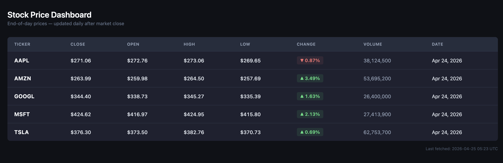

# CI/CD Deployment Pipeline

A production-style backend engineering project demonstrating automated build, test, and deployment of a containerized Python API with a PostgreSQL data layer, an automated stock price ingestion pipeline, and a server-rendered operator dashboard — all deployed to AWS cloud infrastructure.

## Architecture

```
Push to main
     │
     ▼
GitHub Actions (deploy.yml)
     │
     ├── Stage 1: Lint (flake8)
     │
     ├── Stage 2: Test (pytest + SQLite in-memory DB)
     │        └── alembic upgrade head
     │
     ├── Stage 3: Build & Push Docker Image → Docker Hub
     │
     └── Stage 4: SSH Deploy to AWS EC2
              └── docker-compose up (FastAPI + PostgreSQL)
                       └── alembic upgrade head
 
Scheduled GitHub Actions (ingest.yml)
     │
     └── Runs weekdays at 9pm UTC (after US market close)
              └── Fetches AAPL, MSFT, GOOGL, AMZN, TSLA from yfinance
                       └── Deduplicates and writes to PostgreSQL
```

## Tech Stack
 
| Layer | Technology |
|---|---|
| API | Python, FastAPI, Jinja2 |
| Data Pipeline | yfinance, pandas, SQLAlchemy, Alembic |
| Database | PostgreSQL 15 |
| Containerization | Docker, Docker Compose |
| CI/CD | GitHub Actions |
| Infrastructure | Terraform, AWS EC2 |
| Testing | Pytest, unittest.mock |
| Scripting | Bash |

## Screenshots

### Pipeline in GitHub Actions


### API Endpoints on EC2


### Stock Price Dashboard


## API Endpoints
 
| Method | Endpoint | Description |
|---|---|---|
| GET | `/dashboard` | Server-rendered HTML dashboard with color-coded daily change % |
| GET | `/prices/latest` | Most recent close price per ticker (greatest-n-per-group subquery) |
| GET | `/prices/history` | Daily close prices for a ticker over a configurable window |
| GET | `/prices/summary` | Min, max, avg close price per ticker via GROUP BY aggregation |
| GET | `/health` | Health check |
| GET | `/docs` | Interactive Swagger UI |

## How It Works

**CI (Continuous Integration):** Every push to `main` triggers the GitHub Actions pipeline. It first runs `flake8` to lint the code, then `pytest` to run the test suite. If either fails, the pipeline stops and the image is not built.

**CD (Continuous Deployment):** If all tests pass, GitHub Actions builds a Docker image and pushes it to Docker Hub. It then SSHes into the AWS EC2 instance, pulls the latest image, and restarts the container automatically.

**Data Ingestion Pipeline:** A separate `ingest.yml` workflow runs on a cron schedule every weekday at 9pm UTC — after US market close. It fetches end-of-day prices for five tickers (AAPL, MSFT, GOOGL, AMZN, TSLA) from Yahoo Finance via yfinance, applies deduplication logic to ensure idempotent runs, and bulk-inserts new records into PostgreSQL.

**Infrastructure as Code:** The EC2 instance and security group are provisioned entirely with Terraform. The infrastructure can be recreated from scratch with a single `terraform apply`.

**Operator Dashboard:** The `/dashboard` endpoint serves a server-rendered HTML page via Jinja2 showing the latest close prices for all tracked tickers, with color-coded daily change percentages computed by comparing each ticker's latest close to the previous trading day's close.

## Running Locally

## Running Locally
 
**Prerequisites:** Docker and Docker Compose installed and running.
 
```bash
# Clone the repo
git clone https://github.com/jpgoreczky/cicd-pipeline.git
cd cicd-pipeline
 
# Create your local environment file
cp .env.example .env
# Edit .env with your database credentials
 
# Start the full stack (FastAPI + PostgreSQL)
docker-compose up -d
 
# Apply database migrations
alembic upgrade head
 
# Run the ingestion pipeline to populate data
python -m app.ingest
 
# Visit the dashboard
open http://localhost:8000/dashboard
 
# Or explore the API
open http://localhost:8000/docs
```

## Running Tests
 
```bash
pip install -r requirements.txt
pytest
```

Tests use an in-memory SQLite database and mock all external dependencies (yfinance HTTP calls). No running database or network access required.

## Infrastructure Setup

Infrastructure is managed with Terraform:

````bash
cd terraform
terraform init
terraform apply -var="key_name=your-key-name"
````

After apply, Terraform prints the EC2 public IP. Add it as `EC2_HOST` in your GitHub Actions secrets.

## GitHub Actions Secrets Required
 
| Secret | Description |
|---|---|
| `DOCKERHUB_USERNAME` | Docker Hub username |
| `DOCKERHUB_TOKEN` | Docker Hub access token |
| `EC2_HOST` | EC2 public IP (or Elastic IP) |
| `EC2_USERNAME` | EC2 SSH username (`ec2-user` for Amazon Linux) |
| `EC2_SSH_KEY` | Contents of your `.pem` private key |
| `POSTGRES_USER` | PostgreSQL username |
| `POSTGRES_PASSWORD` | PostgreSQL password |
| `POSTGRES_DB` | PostgreSQL database name |

## Project Structure

````
cicd-pipeline/
├── app/
│   ├── templates/
│   │   └── dashboard.html   # Jinja2 operator dashboard
│   ├── tests/
│   │   ├── test_main.py     # API endpoint tests
│   │   ├── test_database.py # ORM and schema tests
│   │   └── test_ingest.py   # Ingestion pipeline tests (mocked)
│   ├── database.py          # SQLAlchemy engine and session
│   ├── ingest.py            # yfinance ingestion pipeline
│   ├── main.py              # FastAPI application and routes
│   └── models.py            # SQLAlchemy ORM models
├── alembic/
│   └── versions/            # Database migration history
├── terraform/
│   ├── main.tf              # EC2 instance, security group, Elastic IP
│   ├── variables.tf         # Input variables
│   └── outputs.tf           # Public IP output
├── .github/
│   └── workflows/
│       ├── deploy.yml       # CI/CD pipeline (lint → test → build → deploy)
│       └── ingest.yml       # Scheduled stock data ingestion
├── docker-compose.yml       # Multi-container local and production setup
├── Dockerfile               # Container definition
├── alembic.ini              # Alembic configuration
├── build.sh                 # Local build and test script
└── requirements.txt         # Python dependencies
````
